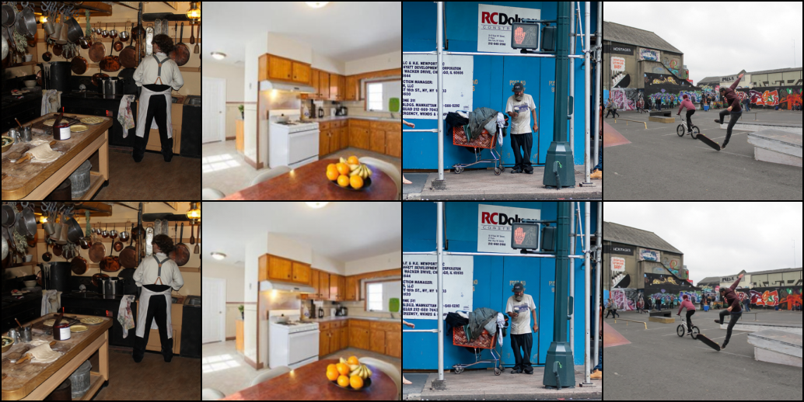

# DVAE Training Quick Start

<p align="center">
  
</p>


```bash
python train.py 
```


## Pre-trained Models

| Model | Dataset | Resolution | Metric  | FID Score   | Download link |
| ----- | ------- | ---------- | ------- | -------- |---------------|
| DVAE  | COCO    | 256×256    | FID-10K | **0.63** |[Google Cloud](https://drive.google.com/file/d/1rqhdDafRSvOIzN2XOZeiLlLNP1iNLrUZ/view?usp=sharing)|


### Results

Input vs Reconstructed Images
<p align="center">  </p>


## Citation

```bibtex
@article{jia2025d2it,
  title={D2iT: Dynamic Diffusion Transformer for Accurate Image Generation},
  author={Jia, Weinan and Huang, Mengqi and Chen, Nan and Zhang, Lei and Mao, Zhendong},
  journal={arXiv preprint arXiv:2504.09454},
  year={2025}
}
```