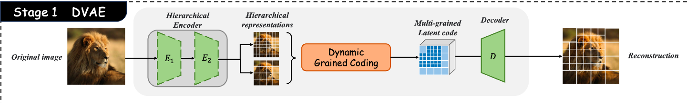

# DVAE Training Quick Start

<p align="center">
  
</p>


```bash
python train_dvae.py
```


### Training Logs

You can view the detailed training process and tracked metrics here:
🔗 W&B Logs: [DVAE Training Run](https://wandb.ai/pranoy/DVAE/runs/pkozdc64?nw=nwuserpranoy)


## Citation

```bibtex
@article{jia2025d2it,
  title={D2iT: Dynamic Diffusion Transformer for Accurate Image Generation},
  author={Jia, Weinan and Huang, Mengqi and Chen, Nan and Zhang, Lei and Mao, Zhendong},
  journal={arXiv preprint arXiv:2504.09454},
  year={2025}
}
```